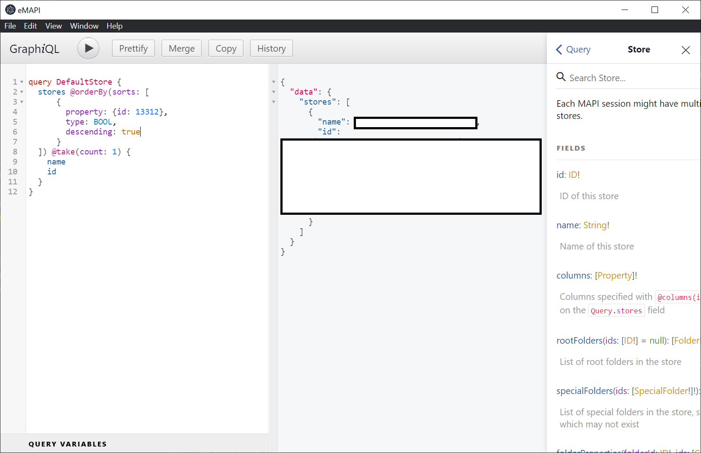

# eMAPI

This is a sample Electron app hosting [GraphiQL](https://github.com/graphql/graphiql) connected to
[Electron-GqlMAPI](https://github.com/microsoft/electron-gqlmapi). It is intended first as a code sample
for [CppGraphQLGen](https://github.com/microsoft/cppgraphqlgen), but it aspires to be the spiritual successor
to [MFCMAPI](https://github.com/stephenegriffin/mfcmapi). It is already quite powerful just by integrating
GraphiQL, and it has the potential to add more diagnostic and debugging features in the future.

This project was originally based on [cppgraphiql](https://github.com/wravery/cppgraphiql), but it has many
upgrades to the build process, packaging, and the implementation since then. It is not cross-platform like
cppgraphiql (which used a trivial service with mock data), but I intend to feed these improvements back into
cppgraphiql. For now, this is a much better starting point if you want to implement your own Electron host
for a CppGraphQLGen service.

## Getting Started

To begin, you will need to satisfy the [requirements](https://github.com/microsoft/gqlmapi#getting-started)
for building GqlMAPI. If you are using Vcpkg to install CppGraphQLGen and GoogleTest as suggested in those
instructions, then you will also need to save an npm config setting for CMake.js to use the vcpkg.cmake
toolchain file:

```cmd
> npm config set cmake_CMAKE_TOOLCHAIN_FILE %VCPKG_ROOT%\scripts\buildsystems\vcpkg.cmake
```

Then you can build and test the module using npm:

```cmd
> npm install
> npm run electron-dev
```

## Sample Queries

This query should return the display name and ID of all your MAPI stores:

```graphql
query AllStores {
  stores {
    name
    id
  }
}
```

To get the default store you can sort the stores in descending order by the
[PR_DEFAULT_STORE](https://docs.microsoft.com/en-us/office/client-developer/outlook/mapi/pidtagdefaultstore-canonical-property)
property and then take just the top element:

```graphql
query DefaultStore {
  stores @orderBy(sorts: [
      {
        property: {id: 13312},
        type: BOOL,
        descending: true
      }
  ]) @take(count: 1) {
    name
    id
  }
}
```

If everything is working, you should get results like this (minus the rectangles hiding personal information):



## Contributing

This project welcomes contributions and suggestions. Most contributions require you to agree to a
Contributor License Agreement (CLA) declaring that you have the right to, and actually do, grant us
the rights to use your contribution. For details, visit https://cla.opensource.microsoft.com.

When you submit a pull request, a CLA bot will automatically determine whether you need to provide
a CLA and decorate the PR appropriately (e.g., status check, comment). Simply follow the instructions
provided by the bot. You will only need to do this once across all repos using our CLA.

This project has adopted the [Microsoft Open Source Code of Conduct](https://opensource.microsoft.com/codeofconduct/).
For more information see the [Code of Conduct FAQ](https://opensource.microsoft.com/codeofconduct/faq/) or
contact [opencode@microsoft.com](mailto:opencode@microsoft.com) with any additional questions or comments.

## Trademarks

This project may contain trademarks or logos for projects, products, or services. Authorized use of Microsoft
trademarks or logos is subject to and must follow
[Microsoft's Trademark & Brand Guidelines](https://www.microsoft.com/en-us/legal/intellectualproperty/trademarks/usage/general).
Use of Microsoft trademarks or logos in modified versions of this project must not cause confusion or imply Microsoft sponsorship.
Any use of third-party trademarks or logos are subject to those third-party's policies.
